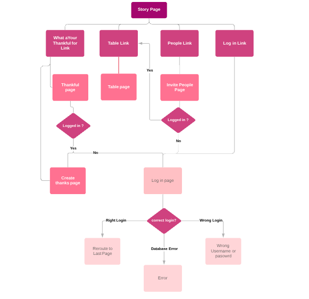
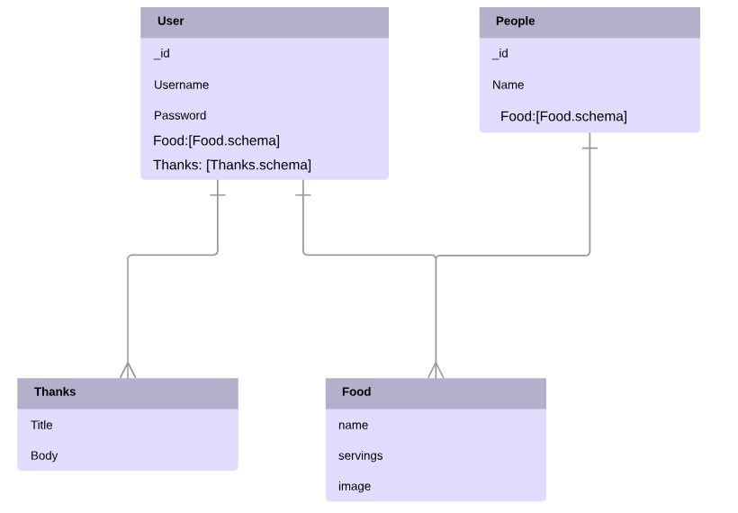

# Final Project: Thanksgiving

## Summary

In this project I will give a breif over view of the history of Thanksgiving, give you the opprotuinty to say what you are thankful for and let you invite people to the table with their choice of food.

### Technologies
+ JavaScript
+ React (react-router)
+ Express (Express-session)
+ MongoDB
+ Mongoose

### User Stories
+ As the user I want to Register/Login to learn the history of Thanksgiving
+ As the user I want to share what I'm thankful for 
+ As the user I want to add people to bring to the table because the more the merrier

### Wireframe 

### Data model

### To Start or Test the App

#### `npm start`

Runs the app in the development mode. 
Open [http://localhost:3000](http://localhost:3000) to view it in the browser.

The page will reload if you make edits. 
You will also see any lint errors in the console.

#### `npm test`

Launches the test runner in the interactive watch mode. 
See the section about [running tests](https://facebook.github.io/create-react-app/docs/running-tests) for more information.

This project was bootstrapped with [Create React App](https://github.com/facebook/create-react-app).

You can learn more in the [Create React App documentation](https://facebook.github.io/create-react-app/docs/getting-started).

To learn React, check out the [React documentation](https://reactjs.org/).
